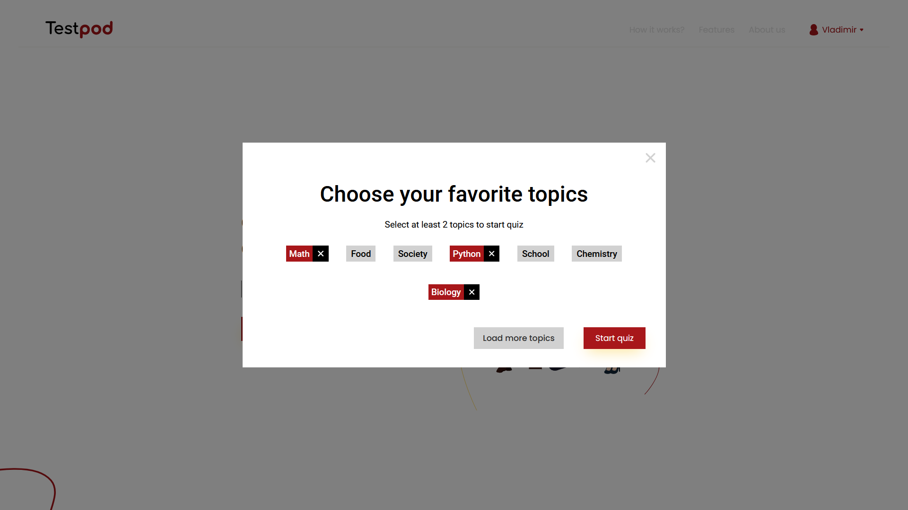
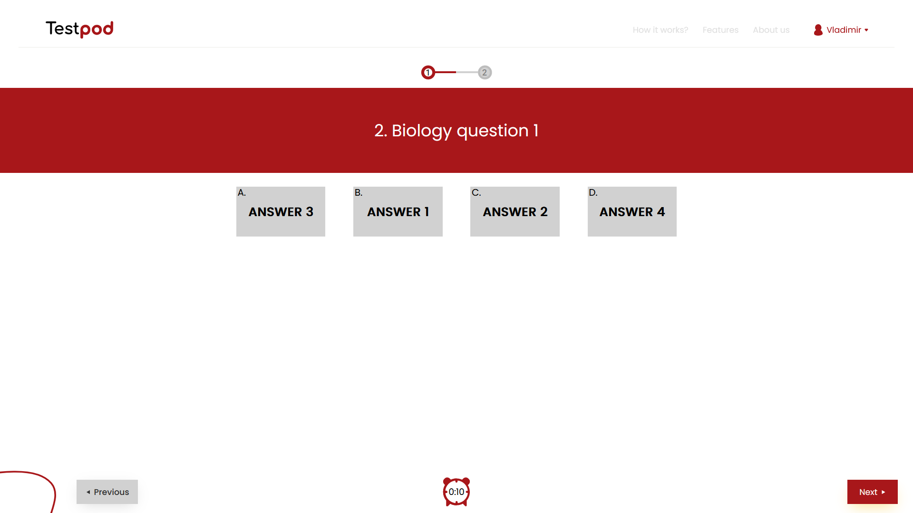
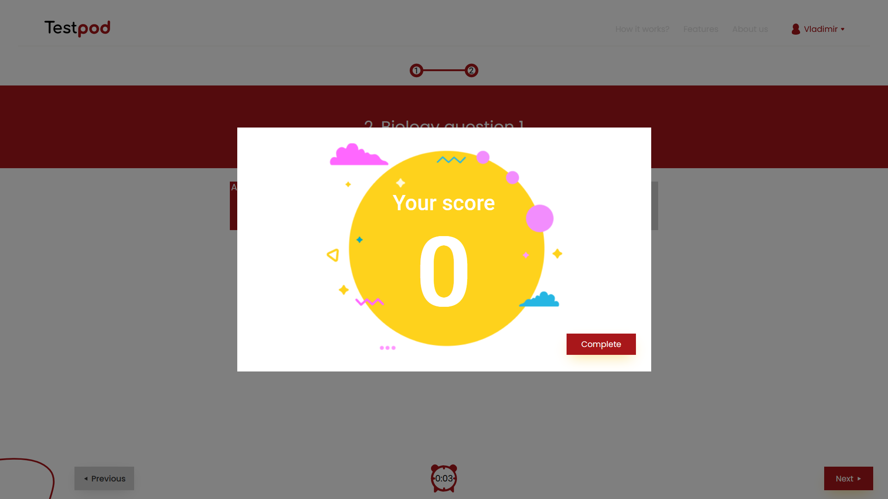
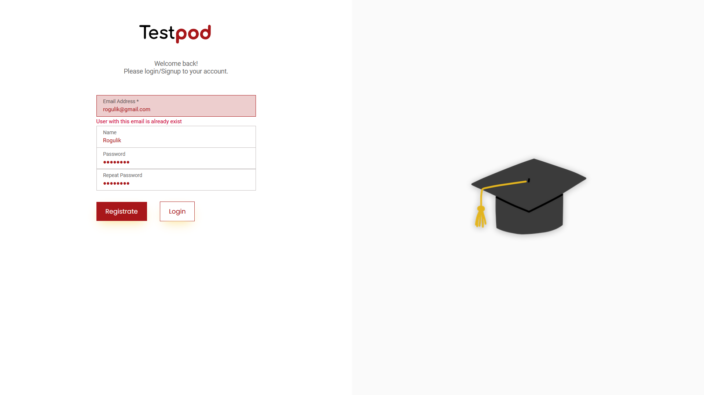
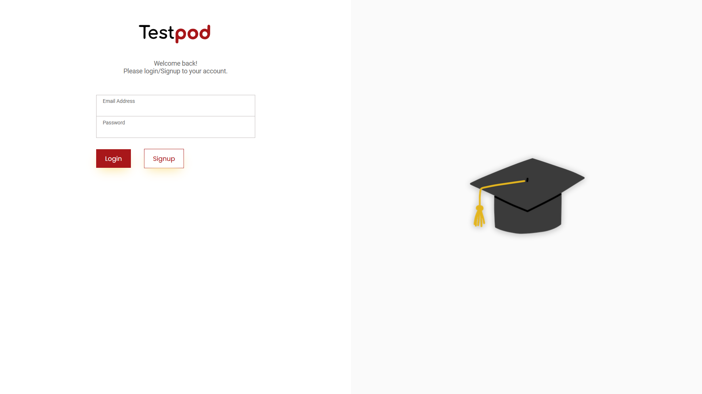

# Setup
## Install node packages
_In **/client** directory:_
```
npm i
```

## Run project
_In **/client** directory_
```
npm run dev
```
_In **/server/server** directory_
```
dotnet run --urls "https://localhost:7094"
```

The application runs on http://localhost:5173/

# Screenshots
Landing page




Quiz page




Registration page 



Login page

